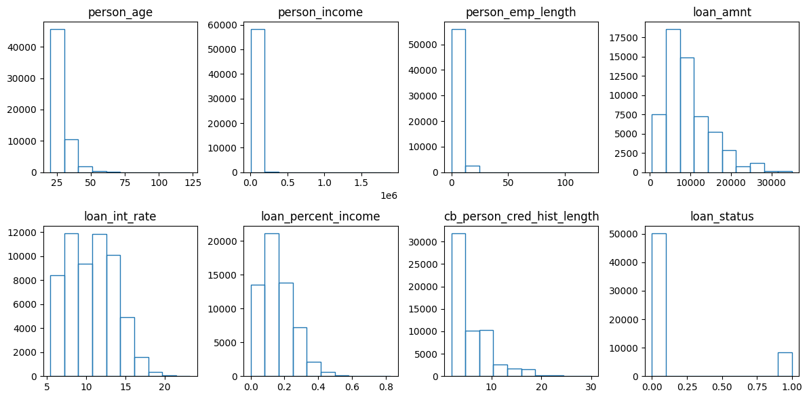
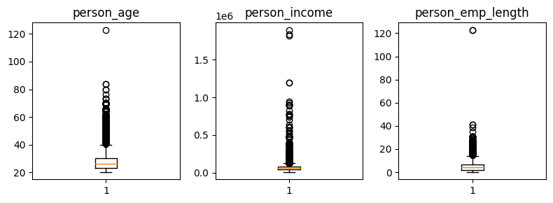
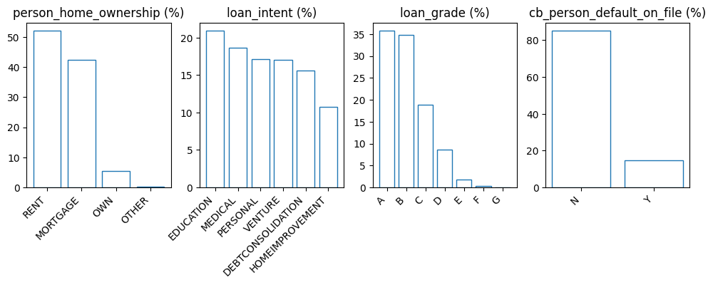
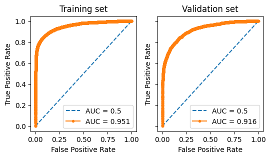
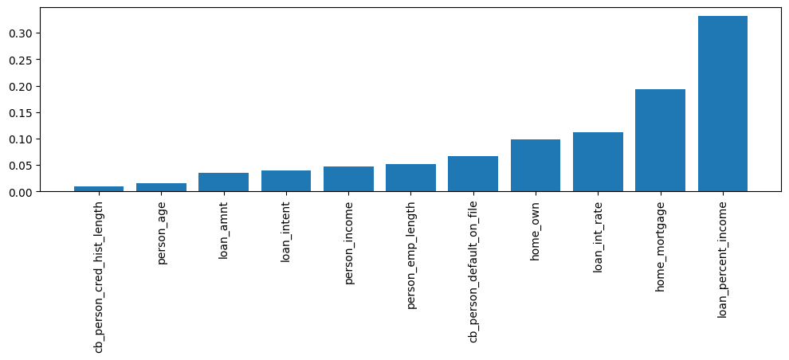
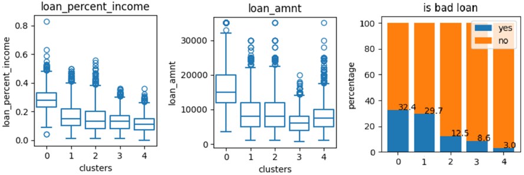
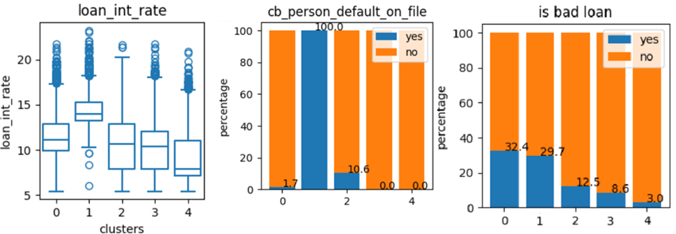
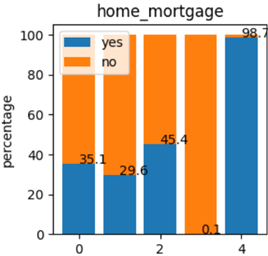
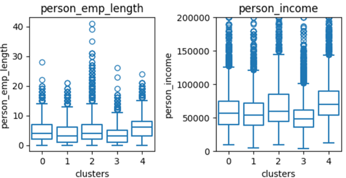

# Loan Approval Model and Analytics
Table of Contents:

- [Machine Leaning Models](#model)
- [Loan Segmentation/Clustering](#clustering)

# Machine Leaning Models for Loan Approval 

## 1. Exploratory Data Analysis (EDA)
### 1a. Data Duplicates

There are 58,645 samples in the "train" dataset.

There is no duplicated sample.

There is no missing value.

### 1b. Data Distribution
#### Numerical Features

The samples with loan_status = 1 contribute to 14.2% of the total samples. This is an imbalanced dataset.

The numerical features plot in the histograms show that all of the features are right-skewed. The 3 features having outliers are 'person_age', 'person_income', and 'person_emp_length'.

The samples with outliers are removed. 'Person_age' should not be more than 100 and 'person_emp_length' should not be more than 80. Meanwhile, outliers in 'person_income' still make sense.

#### Categorical Features

There are originally 4 categorical features. But, 'loan_grade' should not be included as a predictor feature, unless the grading is available before the applicant submits a loan.

### 1c. Train-test split

Twenty percent of the dataset is allocated for the validation set. The training and validation split is applied based on the label stratification. 

## 2. Feature Engineering

### 2a. Optimal Binning

Optimal binning is used to gain insights from the feature information values. The information value of each feature indicates how strongly an individual feature can predict the label. The table below shows how strong the predictive power of each feature.

Numerical Features:

| name     | n_bins    | iv | predictive power |
| -------- | -------- | ------- |  ------- |
| loan_percent_income  | 8  | 1.25 | too good |
| loan_int_rate | 8 | 1.12 | too good |
| person_income  | 8 | 0.61 | too good |
| loan_amnt | 5  | 0.18 | medium |
| person_emp_length | 7 | 0.13 | medium |
| person_age | 3 | 0.0054 | useless |
| cb_person_cred_hist_length | 2 | 0.0013 | useless |

Categorical Features:

| name     | n_bins    | iv | predictive power |
| -------- | -------- | ------- |  ------- |
| loan_grade  | 4  | 1.24 | too good |
| person_home_ownership | 3 | 0.60 | too good |
| cb_person_default_on_file  | 2 | 0.23 | medium |
| loan_intent | 6  | 0.095 | weak |

### 2b. Feature Transformation

The optimal binning transformation is applied to loan_intent as it has the most number of unique values.

One-hot encoding is applied to 'person_home_ownership' and 'cb_person_default_on_file'.

### 2c. Predictive Power Score (PPS)

PPS aims to find which features have a strong relationship. Multiple features with strong relationships can be removed. PPS is the substitute for the commonly used correlation test. 

Running the PPS shows that there is no feature with a strong relationship with another feature. Feature selection is not needed.

## 3. Model Development and Evaluation

XGBoost algorithm is used to train the Machine Learning model. The hyperparameter-tuning is applied using Bayesian Optimization. A set of hyperparameters is gained by optimizing the ROC AUC.

The trained model is stable as indicated by the similarity between the training, testing, and validation ROC AUCs. But, the metrics of precision, f1-score, and accuracy of the training and testing sets are not close.

The threshold score of 0.18, determined using the Kolmogorov-Smirnov plot, is used to differentiate between good and bad loans. The model demonstrates a high recall of 0.85 but a relatively low precision of 0.41. This means the model successfully identifies 85% of bad loans, missing only 15%. However, only 41% of the loans predicted as bad are truly bad, while 59% are actually good loans, leading to missed lending opportunities for the company. The model applies a stringent classification approach, making it less likely to classify loans as good.

| Metrics | Training | Testing | Validation |
| ------ | ------ | ------ | ------ |
| AUC ROC | 0.951 | 0.916 | 0.883 |
| Precision | 0.66 | 0.41 |  |
| Recall | 0.84 | 0.85 |  |
| F1-Score | 0.74 | 0.55 |  |
| Accuracy | 0.92 | 0.80 |  |

### Feature Importances

The most important feature contribution to the model performance is loan_percentage_income, followed by home_mortgage and loan_int_rate.

## 4. Insights

How each feature contributes to predicting the loan_status is described by the optimal binning result.

- Loan_percent_income or the percentage of the loan to income amount is the strongest feature according to the optimal binning and feature importance. 
The higher loan_percent_income, the higher the risk is. Loan_percent_income of 31% or more has a bad loan probability of 71%.

- When the loan interest rate starts from 14.37%, the bad loan rate is at least 46%.

- Borrowers with income lower than 34,994 have a bad loan rate of 35%.

- There is only 1% of bad loans from the borrowers who own their homes.

- If a borrower has a default history, his loan is 2.5 times more likely to be a bad loan.

View the Kaggle notebook [here](https://www.kaggle.com/code/rendyk/loan-approval)

  

# Loan Segmentation/Clustering 

The second notebook segments the loans into 5 clusters with similar characteristics. The first 2 clusters are high-risk loans with a bad rate of 30% to 32%. The other 3 clusters have a bad rate of 3% to 13%.

1. Big loan amount cluster (0)

The first cluster is the loan that has a big amount of loans, usually more than USD 10,000. Hence, the percentage of loan to income is higher, which is more than 20%. Thirty-two percent of the loans are bad loans. This cluster has the highest risk.

2. High interest rate cluster (1)

The second cluster also has high-risk loans due to the high interest rate. The majority of the loan interest rates are higher than 13%. The higher interest rate is decided because all of the users in this cluster have loan defaults in their histories. Thirty percent of loans in this cluster are bad loans.

3. Elder borrower cluster (2)

The unique characteristic of this cluster is that the majority of the borrowers are older than 35 years old. Meanwhile, the other borrowers are younger than 35 years old. They also have the longest credit history.

4. Normal cluster (3)

This cluster does not have special characteristics, except that the borrowers are the least likely to have a home mortgage. They prefer to rent their homes.

5. Borrowers with home mortgage cluster (4)

This cluster is similar to the cluster (3), but with 2 differences. Almost all of the borrowers in this cluster have home mortgages. The income and employment length of the borrowers are slightly higher than those of the cluster (3) 

